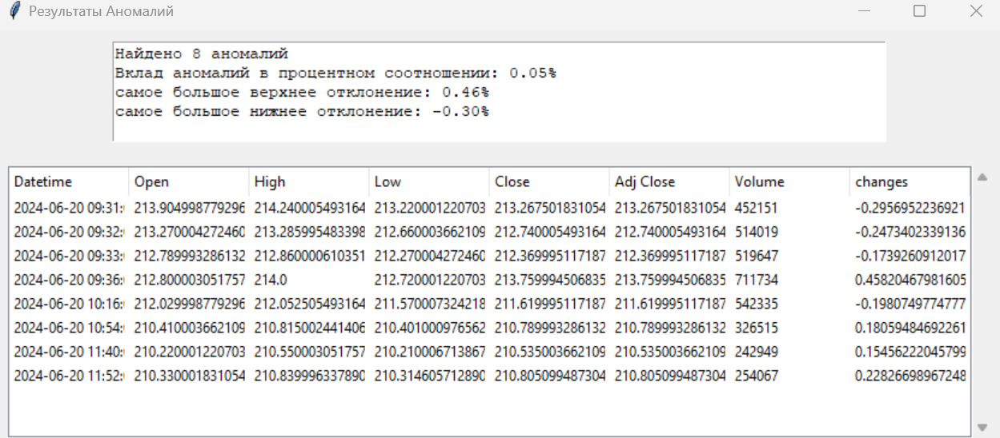

# руководство пользователя

## общее описание ПО
Программа позволяет находить аномалии во временном ряде тикера которые есть на сайте Yahoo Finance.

## требование к системе
1) операционная система windows 10 или выше
2) Python версии 3.11.5
3) библиотеки Tkinter, Pandas, yfinance, matplotlib

## установка программы
1) установить Python версии 3.11.5
2) скачать библиотеки командой `pip install tkinter, pandas, yfinance, matplotlib`
3) скачать zip архив с программой

## запуск программы
1) в командой строке перейти в директиву папки `work`
2) запустить прогрумму командой `python Scripts/main.py`
3) введите тикер и выберите период и интервал из списка
4) нажать на кнопку `обновить`

## описание сценариев работы программы
1. при успешном вводе тикера, периода и интервала пользователю будет показан график продаж конкретного тиккера за выбранный период и интервал  

    - если будут найдены аномалии на временном ряде, то они будут отображаться на графике и будет выведен список всех выявленных аномалий
    
    

    - если не будут найдены аномалии на временном ряде, пользователю будет отображаться только график продаж
    

2. при несупешном вводе тикера, периода или интервала пользователью будет показано сообщение `недостаточно данных`
