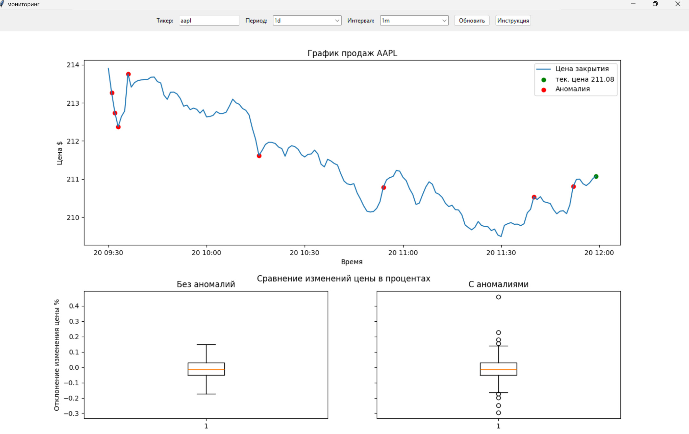
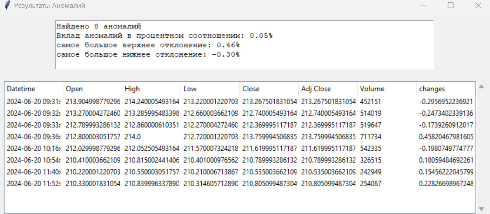
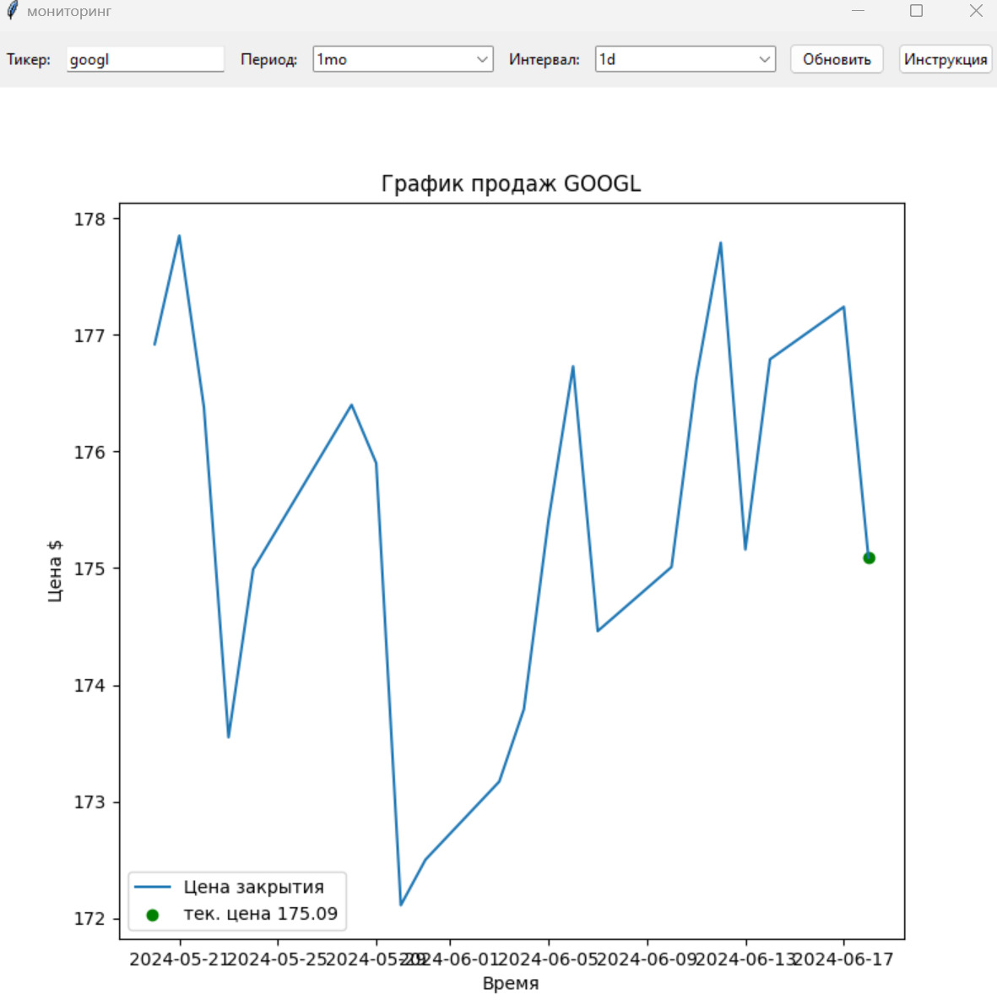
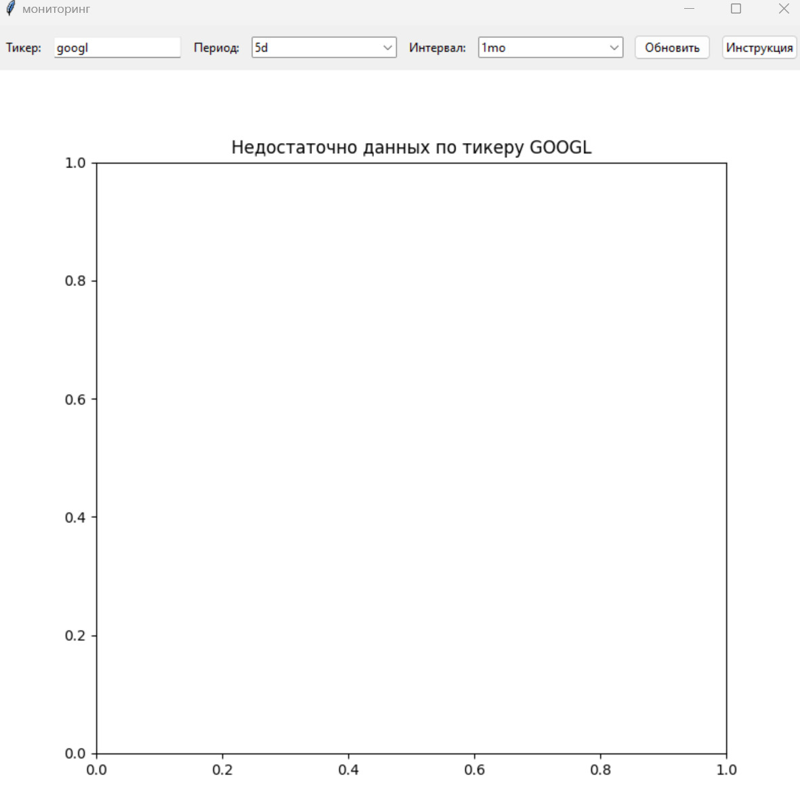

# руководство разработчика

## общее описание ПО
Программа позволяет находить аномалии во временном ряде тикера который выбрал пользователь из сайта yahoo finance.

## требование к системе
1) операционная система windows 10 или выше.

2) Python версии 3.11.5.

3) библиотеки Tkinter, pandas, yfinance, matplotlib.

4) среда разработки - VS Code.

## характеристика и архитиктура программы

### поиск аномалий
поиск аномалий воспроизводится путем нахождения значений которые выходят за рассчитанные границы функцией `calculates_outliners`. функция принимает `df_ticker['changes']`, где `changes` рассчитывается по формуле: `changes = (x1 - x2)*100`, x1 - цена закрытия тикера, x2 - цена закрытия тикера следующего дня. если из колонки `changes` существуют значения, которые выходят за верхний или нижний предел, то такие значения являются аномальными и они заносятся в отдельный датафрейм `anomalies`.

### библиотеки
в программе используются следующие библиотеки:
* Tkinter - используется для графического интерфейса приложения.

* pandas - используется для работы с базой данных определенного тикера.

* matplotlib - используется для построения графиков.

* yfinance - используется для получения данных об изменении цены за определенный промежуток времени с Yahoo Finance.

### структура программы
Информационно-аналитическое приложение размещается в структуре каталогов:
- work - основной каталог.

   - Data - содержит базу данных после работы программы. содержится база данных определенного тикера и отдельно база данных аномальных значений (`AAPL_1d_1m_anomaly.csv, AAPL_1d_1m.csv`).

   - Notes - содержит руководство пользователя и руководство разработчика. Также содержится скриншоты работы программы.

   - Library - содержит библиотеки универсальных функций.

   - Scripts - содержит основный скрипт программы.

## описание библиотек Library
### logic
1) `calculates_outliners` - принимает на вход определенный столбец из датафрейма и возвращает границы значений.

2) `swap_anomaly` - принимает на вход датафрейм, границы значений, название столбца и возвращает датаферйм в котором изменились все аномальные значения, которые выходят за пределы границы на верхнюю и нижнюю границу в определенном столбце.

3) `get_ticker` - принимает на вход название тикера, период, интервал и возвращает датафрейм, который получен с сайта Yahoo Finance c дополнительной колонкой, который рассчитывает изменение цены в процентном соотношении между соседними промежутками времени.

### print
1) `not_enough_data` - возвращает пустой график цены если неправильно введены данные по тикеру.

2) `print_graph` - строит график цены закрытия по тикеру за выбранный промежуток времени.

3) `get_boxplots` - строит бокплоты, которые сравнивают цены закрытия с аномальными и без них. Показывает, насколько аномальные значения выходят за пределы границ в процентах.

### save_data
1) `save_data` - сохраняет базу данных тикера и отдельно базу данных аномальных значений.

### windows
1) `instr_win` - создает окно инструкции, которое описывает как работать с программой.

2) `anomaly_win` - создает окно, в котором содержится список всех выявленных аномальных значений, общее количество, их вклад во временной ряд, максимальное и минимальное отклонение.

## описание основной программы

- `__init__` - инициализирует основное окно приложения, задает его заголовок и размеры, а также вызывает метод `create_widgets` для создания виджетов интерфейса.

 - `create_widgets` - создает основные виджеты для работы с приложением такие как: ввод тикера, периода, интервала, кнопка `Инструкция`, кнопка `Обновить`, поле для отображения графика.

 - `update_graph` - метод, который вызывается при нажатии кнопки `Обновить`. Он выполняет следующие действия:
    1) Получает данные тикера на основе введенных пользователем значений. 

    2) Проверяет, достаточно ли данных для построения графика.

    3) Очищает предыдущий график.

    4) Строит новый график цен.

    5) Вычисляет и отмечает аномальные значения.

    6) Создает боксплоты для сравнения данных с аномалиями и без.
    
    7) Сохраняет данные.

    8) Если обнаружены аномалии, создает окно с информацией об аномалиях.

## результаты тестирования
1. при успешном вводе тикера, периода и интервала пользователю будет показан график продаж конкретного тикера за выбранный период и интервал  

    - если будут найдены аномалии на временном ряде, то они будут отображаться на графике и будет выведен список всех выявленных аномалий
    
    

    - если не будут найдены аномалии на временном ряде, пользователю будет отображаться только график продаж
    

2. при несупешном вводе тикера, периода или интервала пользователью будет показано сообщение `недостаточно данных`


## листинг основной программы
```
import tkinter as tk
from tkinter import ttk
from matplotlib.figure import Figure
from matplotlib.backends.backend_tkagg import FigureCanvasTkAgg

import sys
import os


sys.path.insert(1, os.path.join(sys.path[0], '../Library'))
from save_data import save_data
from logic import *
from print import *
from windows import *

class StockMonitorApp:
    def __init__(self, root):
        self.root = root
        self.root.title("мониторинг")
        self.root.geometry("1000x1000")
        
        self.create_widgets()
        
    def create_widgets(self):
        frame = ttk.Frame(self.root)
        frame.pack(pady=10)

        label = ttk.Label(frame, text="Тикер:")
        label.pack(side=tk.LEFT, padx=5)

        self.entry = ttk.Entry(frame)
        self.entry.pack(side=tk.LEFT, padx=5)
        
        label = ttk.Label(frame, text="Период:")
        label.pack(side=tk.LEFT, padx=5)
        
        list_period = ['1d', '5d', '1mo', '3mo', '6mo', '1y', '2y', '5y', '10y', 'ytd', 'max']
        self.combobox_period = ttk.Combobox(frame, values=list_period, state='readonly')
        self.combobox_period.pack(side=tk.LEFT, padx=5)
        
        label = ttk.Label(frame, text="Интервал:")
        label.pack(side=tk.LEFT, padx=5)
        
        list_interval = ['1m', '2m', '5m', '15m', '30m', '60m', '90m', '1h', '1d', '5d', '1w', '1mo', '3mo']
        self.combobox_interval = ttk.Combobox(frame, values=list_interval, state='readonly')
        self.combobox_interval.pack(side=tk.LEFT, padx=5)

        self.btn_update = ttk.Button(frame, text="Обновить", command=self.update_graph)
        self.btn_update.pack(side=tk.LEFT, padx=5)
        
        self.btn_instuction = ttk.Button(frame, text="Инструкция", command=instr_win)
        self.btn_instuction.pack(side=tk.LEFT, padx=5)
        
        # создание графика
        self.fig = Figure(figsize=(10, 5))
        self.ax = self.fig.add_subplot(111)
        self.canvas = FigureCanvasTkAgg(self.fig, master=self.root)
        self.canvas.get_tk_widget().pack(fill=tk.BOTH, expand=True)
        
        self.fig_boxplots = None
        self.canvas_boxplots = None
        
    
    def update_graph(self):
        
        self.df_ticker = get_ticker(self.entry.get().upper(), self.combobox_period.get(), self.combobox_interval.get())
        
        # если недостаточно данных или акция не имеет определенный интервал или период
        if len(self.df_ticker) < 2:
            not_enough_data(self.ax, self.canvas, self.fig_boxplots, self.entry.get().upper())
        
        # Очистка графика
        self.ax.clear()
        
        print_graph(self.ax, self.df_ticker)
        

        # Вычисление границ
        bound = calculates_outliners(self.df_ticker['changes'])
        
        self.is_outliner = (self.df_ticker['changes'] < bound[0]) | (self.df_ticker['changes'] > bound[1])
        
        # создание датафрейма аномальных значений
        self.anomalies = pd.DataFrame
        
        # Отметка аномальных скачков
        if self.is_outliner.any():
            
            # занесение аномальных значений
            self.anomalies = self.df_ticker[self.is_outliner]
            
            # пометка аномальных значений на графике цены 
            self.ax.scatter(self.anomalies.index, self.anomalies['Close'], color='red', label='Аномалия')
            
            self.df_clean = self.df_ticker.copy()
            
            # замена аномальных значений на вычесленные отрезки
            self.df_clean.loc[self.is_outliner, 'changes'] = swap_anomaly(self.df_clean, self.is_outliner, 'changes', bound)

            # Создание боксплотов для сравнения с - без аномалий 
            self.fig_boxplots, self.canvas_boxplots = get_boxplots(self.fig_boxplots, self.df_clean, self.df_ticker, self.root, self.canvas_boxplots)
        else:  
            self.canvas_boxplots.get_tk_widget().destroy()
            
        self.ax.set_title(f"График продаж {self.entry.get().upper()}")
        self.ax.set_xlabel("Время")
        self.ax.set_ylabel("Цена $")
        self.ax.legend()

        self.canvas.draw()
        
        save_data(self.df_ticker, self.entry.get().upper(), self.combobox_period.get(), self.combobox_interval.get(), self.anomalies,)
        
        if self.is_outliner.any():
            # создание окна с аномалиями
            anomaly_win(self.anomalies, self.df_ticker, self.is_outliner)

if __name__ == '__main__':
    root = tk.Tk()
    app = StockMonitorApp(root)
    root.mainloop()

```

## листинг библиотек Library
### logic.py
```
import yfinance as yf
import pandas as pd

# функция поиска границ
def calculates_outliners(data):
    q25 = data.quantile(0.25)
    q75 = data.quantile(0.75)
    iqr = q75 - q25
    bound = (q25 - 1.5 * iqr, q75 + 1.5 * iqr)
    return bound 

# замена аномальных значений на вычесленные отрезки
def swap_anomaly(df, is_outliner, name_col, bound):
    return df.loc[is_outliner, name_col].apply(lambda x: bound[0] if x < 0 else bound[1])

#получение данных тикера
def get_ticker(ticker_name, period, interval):
    
    ticker = yf.download(ticker_name, period=period, interval=interval)
    df_ticker = pd.DataFrame(ticker)
    
    # добавление нового столбца для поиска аномалий при помощи изменения цены закрытия
    df_ticker['changes'] = (df_ticker['Close'] / df_ticker['Close'].shift(1) -1)*100
    df_ticker['changes'] = df_ticker['changes'].fillna(0)
    
    return df_ticker
```
### print.py
```
from matplotlib import pyplot as plt
from matplotlib.backends.backend_tkagg import FigureCanvasTkAgg
import tkinter as tk

def not_enough_data(ax, canvas, fig_boxplots, name):
    ax.clear()
    ax.set_title(f"Недостаточно данных по тикеру {name}")
    canvas.draw()
    if fig_boxplots:
        fig_boxplots.clear()
        return
        
def print_graph(ax, df):

    # Построение графика цены
    ax.plot(df['Close'], label='Цена закрытия')
        
    # метка текущей цены закрытия акции
    ax.scatter(df.index[-1], df['Close'][-1], color='green', label=f"тек. цена {round(df['Close'][-1], 2)}")

# Создание боксплотов для сравнения с - без аномалий    
def get_boxplots(fig_boxplots, df_clean, df_ticker, root, canvas_boxplots):
    # Очистка бокслплотов аномалий
    if fig_boxplots:  
        canvas_boxplots.get_tk_widget().destroy()
    
    
    fig_boxplots, (ax1, ax2) = plt.subplots(sharey=True, nrows=1, ncols=2, figsize=(10, 5))
            
    ax1.boxplot(df_clean['changes'])
    ax1.set_title("Без аномалий")
    ax1.set_ylabel("Отклонение изменения цены %")

    ax2.boxplot(df_ticker['changes'])
    ax2.set_title("С аномалиями")

    fig_boxplots.suptitle("Сравнение изменений цены в процентах")
    
    canvas_boxplots = FigureCanvasTkAgg(fig_boxplots, master=root)
    canvas_boxplots.get_tk_widget().pack(fill=tk.BOTH, expand=True)
    
    return fig_boxplots, canvas_boxplots
```

### save_data.py
```
import pandas as pd

def save_data(df, ticker, period, interval, df_anomaly = pd.DataFrame()):
        if not df_anomaly.empty:
                df.to_csv(f'Data/{ticker}_{period}_{interval}.csv')
        
                df_anomaly.to_csv(f'Data/{ticker}_{period}_{interval}_anomaly.csv')
        else:
                df.to_csv(f'Data/{ticker}_{period}_{interval}.csv')

```

### windows.py
```
import tkinter as tk
from tkinter import ttk

def instr_win():
    root = tk.Tk()
    root.title("Инструкция")
    
    instruction_text = (
        "1) В окне 'тикер' вводятся все возможные тикеры, которые можно найти на сайте Yahoo Finance "
        "(акции, криптовалюты и т.д.).\n"
        "2) В окне 'период' вводится необходимый период из предложенного списка.\n"
        "3) В окне 'интервал' вводится необходимый интервал из предложенного списка.\n"
        "4) Для появления или обновления графика нажать на кнопку 'Обновить'.\n"
        "Примечание: некоторые тикеры не поддерживают определенные периоды или интервалы. Все возможные комбинации смотрите на Yahoo Finance."
    )
    
    label = tk.Label(root, text=instruction_text, justify=tk.LEFT, wraplength=400)
    label.pack(padx=10, pady=10)
    
    root.mainloop()

def anomaly_win(df_anomalies, df, is_outliner):
    root = tk.Tk()
    root.title("Результаты Аномалий")
    
    # описание для аномалий
    text_widget = tk.Text(root, wrap='word', height=5, width=80)
    text_widget.pack(padx=10, pady=10)
    text_widget.insert(tk.END, f'Найдено {is_outliner.sum()} аномалий\n')
    text_widget.insert(tk.END, f'Вклад аномалий в процентном соотношении: {is_outliner.sum() / len(df):.2f}%\n')
    text_widget.insert(tk.END, f'самое большое верхнее отклонение: {df_anomalies.changes.max():.2f}%\n')
    text_widget.insert(tk.END, f'самое большое нижнее отклонение: {df_anomalies.changes.min():.2f}%')
    text_widget.config(state=tk.DISABLED)
    
    # таблица аномальных значений
    frame = tk.Frame(root)
    frame.pack(padx=10, pady=10, fill=tk.BOTH, expand=True)

    tree = ttk.Treeview(frame)
    tree.pack(side='left', fill=tk.BOTH, expand=True)
    
    df_anomalies.reset_index(inplace=True)
    
    
    columns = list(df_anomalies.columns)
    tree['columns'] = columns
    tree.heading("#0", text="", anchor=tk.W)
    tree.column("#0", width=0, stretch=tk.NO)

    
    for col in columns:
        tree.heading(col, text=col, anchor=tk.W)
        tree.column(col, anchor=tk.W, width=100)

    
    for index, row in df_anomalies.iterrows():
        tree.insert("", tk.END, text=index, values=list(row))

    # прокрутка таблицы
    scrollbar = ttk.Scrollbar(frame, orient="vertical", command=tree.yview)
    scrollbar.pack(side='right', fill='y')
    tree.configure(yscrollcommand=scrollbar.set)

    root.mainloop()
    
    return
```